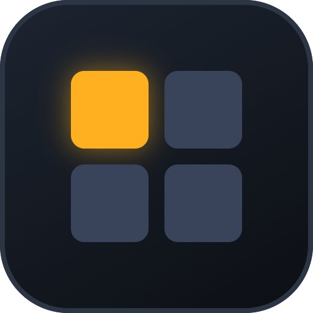
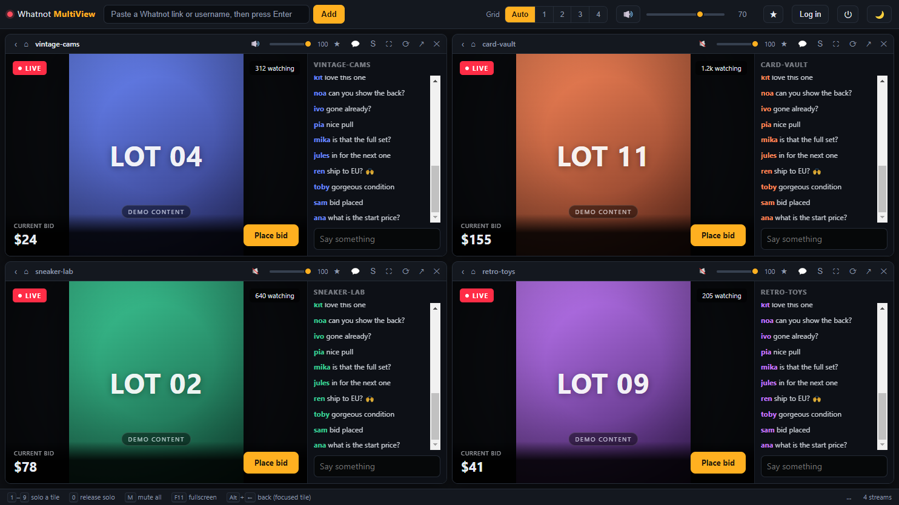

<div align="center">



# Whatnot MultiView

**Watch several Whatnot livestreams side by side — with a dark UI and per-stream volume control.**

[Download](https://github.com/clemensgoering/whatnot-multiview/releases) ·
[Guide](docs/README.md) ·
[Installation](docs/installation.md) ·
[Audio](docs/audio.md) ·
[Troubleshooting](docs/troubleshooting.md)

</div>



Whatnot shows one stream at a time. Browser tabs do not solve it either, because
every tab keeps playing audio and you end up hunting for the one that is talking.
MultiView puts the streams in a grid and gives each tile its own volume slider, a
mute button and a solo button. Press `1`–`9` to hear exactly one stream and
silence the rest — without pausing any of them.

> Not affiliated with, endorsed by, or connected to Whatnot Inc. This is a
> personal viewer that renders whatnot.com in embedded browser views. You need
> your own Whatnot account, and your use of the site remains subject to Whatnot's
> Terms of Service.

## Install

**[Download the installer](https://github.com/clemensgoering/whatnot-multiview/releases)** for Windows, macOS or Linux. No Node.js, no terminal.

The builds are not code-signed, so Windows SmartScreen shows a warning on first
launch — see [Installation](docs/installation.md#about-the-security-warning) for
what to click, and for building from source if you would rather not.

<details>
<summary>Run from source instead</summary>

```bash
git clone https://github.com/clemensgoering/whatnot-multiview.git
cd whatnot-multiview
npm install
npm start
```

Requires Node.js 18+. `npm start` goes through `launch.js`, which strips
`ELECTRON_RUN_AS_NODE` — without that, launching from a VS Code terminal makes
Electron start as plain Node and the window never appears.

</details>

## What it does

| | |
| --- | --- |
| **Per-stream audio** | Own volume slider and mute per tile, plus a master level |
| **Solo** | `1`–`9` hears one stream and silences the rest; nothing pauses |
| **Focus mode** | One tile fills the window while the others keep playing unseen |
| **Flexible grid** | Auto-square layout or a forced 1–4 columns, drag to reorder |
| **Dark by default** | Light theme one click away, both as CSS custom properties |
| **Chat toggle** | Collapse the chat to give the video the room; shift-click to pick it by hand |
| **Favourites** | Save any page a tile is showing and reopen it in one click |
| **Real navigation** | Back and home buttons per tile, so a tile is never a dead end |
| **One login** | All tiles share a session; it survives restarts |

Everything — stream list, volumes, layout, theme — is remembered between sessions.

Full walkthrough in the **[guide](docs/README.md)**.

## Why a desktop app and not a website

This was the first thing checked, and it settles the architecture:

```console
$ curl -sSI https://www.whatnot.com/ | grep -i x-frame-options
X-Frame-Options: SAMEORIGIN
```

Whatnot sends `X-Frame-Options: SAMEORIGIN` plus a strict Content-Security-Policy.
No website and no `<iframe>` can embed those streams — a browser-based multiview
is impossible, not merely inconvenient.

This app uses Electron `<webview>` containers instead. Those are genuine separate
browser views rather than frames, so the restriction does not apply. Each tile is
a full browser: you can log in, browse, bid and chat inside it.

## A note on browser identity

An early version set a fake `Chrome/131` user agent while `navigator.userAgentData`
still reported `Chromium 130`. Both Google's sign-in and Whatnot's fraud detection
flagged exactly that contradiction — a browser that misrepresents itself
inconsistently is a stronger bot signal than an honest one. Removing the spoof
fixed the login.

So this app deliberately does **not** disguise its browser identity. That
detection protects against account takeover and bidding bots, working around it
violates Whatnot's terms, and bidding involves real money.

Google sign-in stays blocked regardless — that is a fixed Google policy for
embedded views. Use email and password, or Apple or Facebook. Details in
[Troubleshooting](docs/troubleshooting.md).

## Project layout

| Path | Purpose |
| --- | --- |
| `main.js` | Electron main process, shared session, popup and IPC rules |
| `preload.js` | Narrow bridge to the renderer |
| `renderer.js` | State, tiles, audio logic, layout |
| `chat-inject.js` | Source of the script injected into stream pages to hide the chat |
| `index.html` · `styles.css` | Interface and colour tokens |
| `launch.js` | Dev launcher with a cleaned environment |
| `reset-session.js` | Deletes the stored session from the command line |
| `tools/make-assets.js` | Regenerates the screenshots and app icon |
| `docs/` | The guide |

Tiles are reconciled rather than re-rendered: existing `<webview>` elements are
moved in the DOM, never recreated, because recreating one restarts the stream.

### Regenerating screenshots and icons

```bash
npm run assets
```

Renders the real interface with a local demo page in the tiles — so no
third-party content or account details land in the repository — and writes
`docs/images/*.png`, `build/icon.png` and `build/icon.ico`.

## Known limitations

- A Whatnot login is required, via email and password rather than Google.
- Many parallel video streams cost CPU and bandwidth. Beyond roughly six at once
  it pays to close tiles you are not watching.
- Volume control depends on Whatnot's player using standard `<video>` elements.
  Should that change, muting and solo still work at the webview level; only the
  fine-grained levels would be affected.

## Contributing

Issues and pull requests are welcome. There is no build step for the app itself —
edit the files and run `npm start`.

## License

MIT — see [LICENSE](LICENSE).
