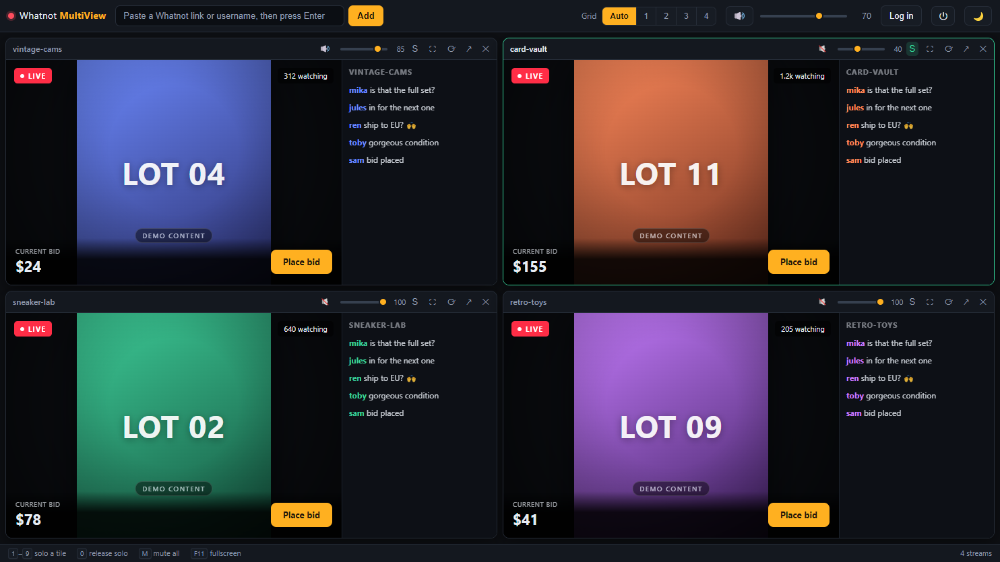

# Audio

[Guide](README.md) · [Installation](installation.md) · [First steps](getting-started.md) · **Audio** · [Layout](layout.md) · [Troubleshooting](troubleshooting.md)

---

This is the part the app exists for. Four streams playing at once is useless if
you cannot control who is talking.

## Per-tile controls

Every tile header carries its own audio strip.


From left to right:

| Control | What it does |
| --- | --- |
| 🔊 / 🔇 | Mute or unmute this tile |
| Slider | This tile's own volume, 0–100 (85 in the shot above) |
| `S` | **Solo** — hear only this stream |
| ⛶ | Enlarge the tile, see [Layout](layout.md#focus-mode) |
| ⟳ | Reload the stream |
| ↗ | Open this stream in your system browser |
| ✕ | Remove the tile |

## Solo

Solo is the fastest control in the app. Click `S` — or press the tile's number
key — and everything except that stream goes quiet.



The soloed tile gets a green border; the silenced ones dim their titles. Nothing
pauses: the other streams keep running, so you miss nothing when you switch back.

Press the same key again, or `0`, to release.

```
1 … 9   solo that tile (press again to release)
0       release solo
```

## Master level

The slider in the toolbar scales every tile at once, and 🔊 next to it (or `M`)
mutes everything. Use the master level to set a comfortable overall volume, and
the per-tile sliders to balance a loud seller against a quiet one.

## How the three layers combine

The rules, in order of precedence:

1. **Master mute** silences everything, no exceptions.
2. **Solo**, if active, silences every tile but the soloed one.
3. Otherwise a tile's own **mute** decides.

An audible tile then plays at `tile volume × master volume`. So a tile at 50 with
the master at 70 ends up at 35 % of full scale.

One convenience worth knowing: unmuting a tile while a *different* tile is soloed
releases the solo. Otherwise the click would appear to do nothing.

## What happens under the hood

Volume is applied by setting `volume` on the `<video>` elements inside the page,
re-applied by a short interval and a `MutationObserver` because Whatnot rebuilds
its player on reconnect.

Muting does not rely on that. It is applied at the webview level with
`setAudioMuted()`, so even if Whatnot changed its player entirely, muting and solo
would keep working — only the fine-grained levels would be affected.

---

← [First steps](getting-started.md) · Next: [Layout](layout.md) →
