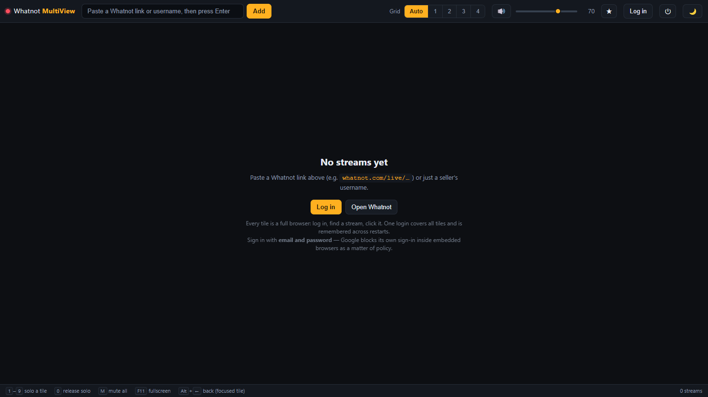
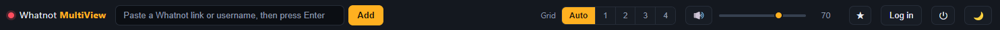

# First steps

[Guide](README.md) · [Installation](installation.md) · **First steps** · [Audio](audio.md) · [Layout](layout.md) · [Troubleshooting](troubleshooting.md)

---

## 1. The empty app

On first launch there are no streams yet.

Start with **Log in**. It opens Whatnot's login page as a tile.

## 2. Sign in

Sign in with **email and password**.

Google sign-in does not work here and cannot be made to: Google blocks its flow
inside embedded browser views as a fixed anti-phishing policy. See
[Troubleshooting](troubleshooting.md#google-sign-in-is-blocked) for the full
story. Apple and Facebook work.

Two things to know:

- A cookie banner appears first. It blocks the page until you answer it.
- All tiles share one session, so this login covers every tile and survives
  restarts.

## 3. Add streams

Paste into the input at the top left. Three forms are accepted:

| Input | Result |
| --- | --- |
| `https://www.whatnot.com/live/…` | opens that link |
| `whatnot.com/live/…` | scheme is added for you |
| `seller123` | opens that seller's profile — and jumps straight to their stream if they are live |

Because every tile is a full browser, the easiest route is often different:
open one tile on Whatnot, browse inside it, and click a stream directly.

New tiles **start muted**. Adding a stream never makes everything talk at once —
you decide what you want to hear. See [Audio](audio.md).

## Navigating inside a tile

A tile is a browser, so it has a browser's problem: click into a stream and you
have left the page that listed the others.

| Control | What it does |
| --- | --- |
| ‹ | Back, one step in this tile's history |
| ⌂ | Open the Whatnot home page in a **new** tile |
| <kbd>Alt</kbd>+<kbd>←</kbd> | Back in the tile that is currently in [focus mode](layout.md#focus-mode) |

⌂ deliberately opens a *new* tile rather than navigating the current one — you go
looking for the next stream without losing the one you are watching. Close the
browsing tile again with ✕ once you have found something.

## Favourites

Sellers you watch often do not need to be searched for every time.

- **★ on a tile** saves whatever page that tile is currently showing. Press it
  again to remove it.
- **★ in the toolbar** opens the list. Click an entry to open it as a new tile,
  or ✕ to drop it.

Favourites are stored separately from your stream list, so clearing tiles never
loses them.

## 4. Arrange and listen

At this point you have a grid. The two things worth learning next:

- [Audio](audio.md) — solo, mute, and the master level. This is what the app is for.
- [Layout](layout.md) — columns, focus mode, reordering, themes.

Your stream list, volumes, layout and theme are saved automatically and come
back on the next start.

## Signing out

The **⏻** button in the toolbar clears the stored session after a confirmation.
Your stream list is kept. Use it when you want to switch accounts, or when a
login gets stuck.

---

← [Installation](installation.md) · Next: [Audio](audio.md) →
