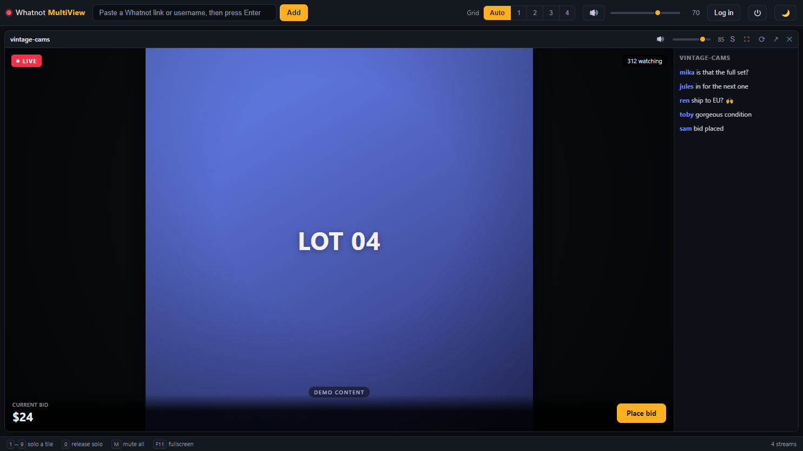
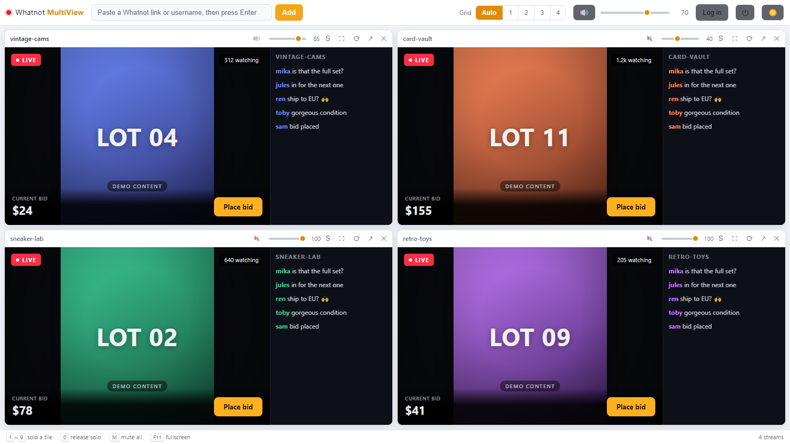

# Layout

[Guide](README.md) · [Installation](installation.md) · [First steps](getting-started.md) · [Audio](audio.md) · **Layout** · [Troubleshooting](troubleshooting.md)

---

## Grid columns

The **Grid** selector in the toolbar decides how tiles are arranged.

- **Auto** keeps the grid roughly square: two streams sit side by side, four
  become a 2×2, nine become a 3×3.
- **1**, **2**, **3**, **4** force that many columns regardless of how many
  streams you have. Useful on an ultrawide monitor, where Auto would rather stack
  than spread.

## Focus mode

The **⛶** button on a tile makes it fill the window.

The important part: the other tiles keep running. They are hidden, not paused, so
their audio continues and nothing reconnects when you come back. This is how you
watch one auction closely while still hearing the others.

Press **Esc** or click ⛶ again to return to the grid.

## Reordering

Drag a tile by its **header** to swap it with another. The drop target is
outlined while you drag.

Order matters beyond looks: the number keys `1`–`9` follow the grid order, so
putting your most-watched sellers first makes solo a single keystroke away.

## Themes

Dark is the default. The 🌙 button switches to a light theme.

Both themes are defined as CSS custom properties at the top of `styles.css`, so
recoloring the app means editing one block rather than hunting through selectors.

## Fullscreen

`F11` puts the whole window into fullscreen. Combine it with focus mode for a
single stream filling the screen, or leave the grid on for a wall of streams.

## What gets remembered

Stream list, per-tile volumes and mute states, master level, column choice and
theme are all saved and restored on the next start. Focus and solo are not —
those are momentary, and starting a session with a silent grid would be confusing.

---

← [Audio](audio.md) · Next: [Troubleshooting](troubleshooting.md) →
